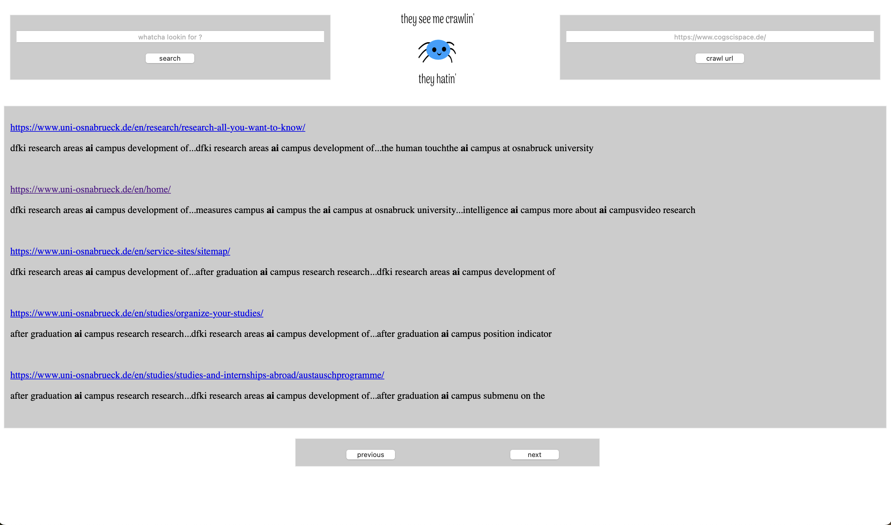
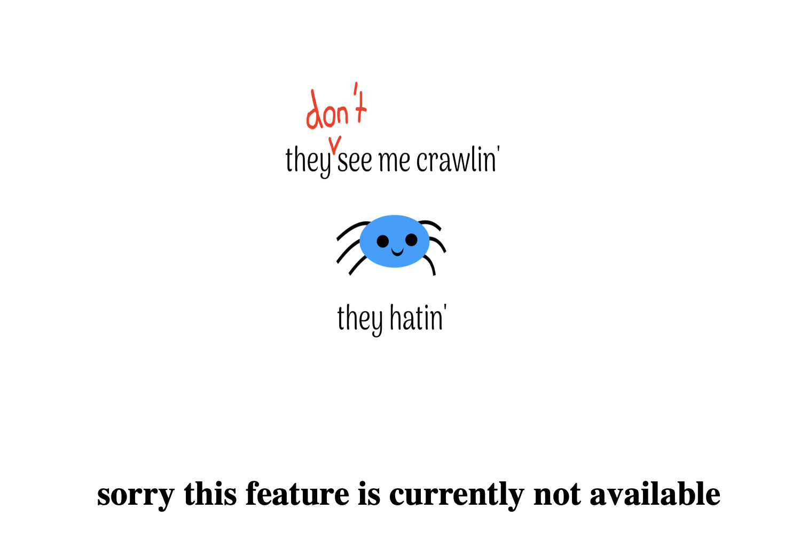

# simple search engine

this is a simple search engine created in python using multiprocessing to *crawl* the *web*, then save the information using <a href="https://whoosh.readthedocs.io/en/latest/">whoosh</a> and lastly building a website using <a href="https://flask.palletsprojects.com/en/3.0.x/">flask</a> to then query the index

## How-To 
1. create and activate a virtual environment  
2. install all dependencies in requirements.txt
3. build index using the crawler and whoosh
	* either change code in main and use the crawler directly

			python crawler.py 
	* or use arguments like

			python crawler.py -url test.com
			
	* or use fill\_index.py which loops over all given urls in search\_url.txt
	
			python fill_index.py
			
4. start web application
	* either start manually
	
			python website.py
	
	* or make use of website.wsgi
	

## crawler.py
this file contains a crawler class, which is then used in the crawl function  
there are many arguments inside the function such as  

1. number of processes
2. search depth
3. allowed number of urls in single crawl
4. printing visited urls
5. ...
6. and the quite confusing "relative\_absolute\_path", which indicates whether the 'host url' should be extended, e.g. https://whoosh.readthedocs.io/en/latest/ needs the '/en/latest' , otherwise found urls are wrongly assembled

## website.py
this file contains a few html pages which get rendered using flask  

### a few screenshots

The webpage after the user searched for "ai" : 
 
 

 

The webpage after the user wanted to crawl an url, but the feature was turned off : 
 

 
